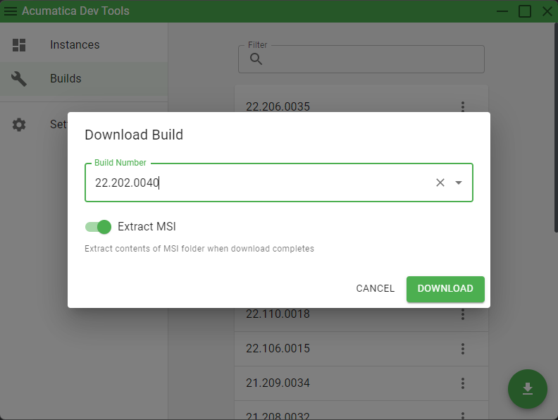
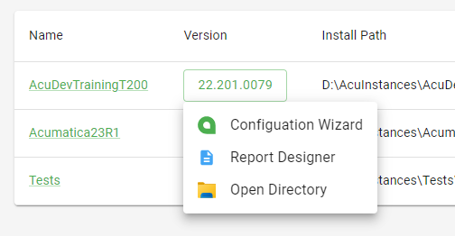

# Acumatica Dev Tools


## Latest Release

[![Github Tag][github-tag-image]][github-tag-url]
<br/><br/>

# Features

## Download and extract any build:


<br/><br/>

## Easily launch the Acuamtica ERP Configuation Wizard & Report Designer:



<br/><br/><br/><br/>

# Development

## Install

Clone the repo and install dependencies:

```bash
git clone https://github.com/EvanTrow/acuamtica-dev-tools.git
cd acuamtica-dev-tools
npm install
```

**Having issues installing? See our [debugging guide](https://github.com/electron-react-boilerplate/electron-react-boilerplate/issues/400)**

## Starting Development

Start the app in the `dev` environment:

```bash
npm start
```

## Packaging for Production

To package apps for the local platform:

```bash
npm run package
```

## License

MIT © [EvanTrow](https://github.com/EvanTrow)

[github-tag-image]: https://img.shields.io/github/tag/EvanTrow/acuamtica-dev-tools.svg?label=Download&style=for-the-badge
[github-tag-url]: https://github.com/EvanTrow/acuamtica-dev-tools/releases/latest
